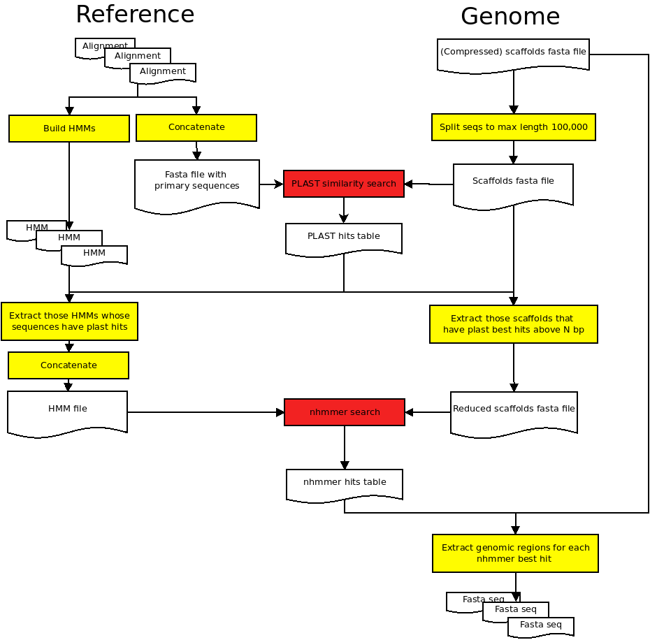

# Birdscanner version 2

- Last modified: tor sep 03, 2020  11:57
- Sign: JN

## Description

The workflow (Fig. \ref{workflow}) will try to extract known genomic regions
(based on multiple- sequence alignments and HMMs; the *Reference*) from a
genome file (the *Genome*). The approach taken is essentially a search with
HMM's against a reference genome, with an extra step where an initial
similarity search is used to reduce the input data down to matching HMM's and
genomic regions.

Both the known genomic regions (multiple nucleotide-sequence alignments in
fasta format), and the genome files (fasta format, one or several scaffolds)
must be provided by the user. If several genomes are provided, the workflow can
also collect each genomic region extracted from each genome (the *Fasta seq*
files), and produce unaligned "gene" files that can be the input to a
multiple-sequence alignment software.

{width=60%}

## Installation and testing

### Alt. 1: Manual installation

1. Install prerequisites (see section [Software
   prerequisites](#software-prerequisites) for details). On a Debian-based
   GNU/Linux system (tested on Ubuntu Linux 20.04), this can be done using

        $ sudo apt install build-essential git hmmer ncbi-blast+ pigz plast snakemake
        $ git clone https://github.com/nylander/split-fasta-seq.git
        $ cd split-fasta-seq/src/ && make && sudo make install 

2. Clone birdscanner2 from GitHub:

        $ git clone https://github.com/Naturhistoriska/birdscanner2.git

3. Optional: Download example data (636 MB) and test the installation

        $ cd birdscanner2
        $ wget -O data.tgz "http://owncloud.nrm.se/index.php/s/d6EuUJSHlQwCN6X"
        $ tar xfz data.tgz && rm data.tgz
        $ snakemake -j -p --dry-run
        $ snakemake -j -p

## Input

Place properly named genome files (fasta format, gzip compressed, `.gz`) in
`data/genomes/` and properly named reference files (aligned fasta files,
`.fas`) in `data/references/`. See section [Data](#data) for details on the data
format.

Example set up:
```
data/
├── genomes
│   ├── Apa.gz
│   └── Bpa.gz
└── references
    ├── 1.fas
    └── 2.fas
```

## Output

Output are written to the folder `results/`.

Example output:
```
results/
├── genes
│   ├── 1.fas
│   └── 2.fas
├── genomes
│   ├── Apa
│   │   ├── Apa.1.fas
│   │   └── Apa.2.fas
│   └── Bpa
│       ├── Bpa.1.fas
│       └── Bpa.2.fas
└── hmmer
    ├── Apa.hmmer.out.gz
    └── Bpa.hmmer.out.gz
```

## Run

    $ cd birdscanner2
    $ snakemake -j -p 
    $ snakemake -j --report

\newpage 

## Software prerequisites

The workflow is tested on GNU/Linux (Ubuntu 20.04), and uses standard Linux
(bash) tools in addition to the main workflow manager `snakemake`.  A list of
tools (and tested version) are given below.

- [bash](https://www.gnu.org/software/bash/) (5.0.17)
    - awk (5.0.1)
    - cat (8.30)
    - find (4.7.0)
    - grep (3.4)
    - sort (8.30)
- [python](https://www.python.org/downloads/) (3.8.2)
- [snakemake](https://snakemake.github.io/) (5.10.0)
- [pigz](https://zlib.net/pigz/) (2.4)
- [makeblastdb](https://ftp.ncbi.nlm.nih.gov/blast/executables/blast+/LATEST/) (2.9.0+)
- [blastdbcmd](https://ftp.ncbi.nlm.nih.gov/blast/executables/blast+/LATEST/) (2.9.0+)
- [plast](https://github.com/PLAST-software/plast-library) (2.3.2)
- [hmmbuild](http://hmmer.org/download.html) (3.3)
- [hmmpress](http://hmmer.org/download.html) (3.3)
- [nhmmer](http://hmmer.org/download.html) (3.3)
- [perl](https://www.perl.org/get.html) (5.30.0)
- [fasta2stockholm.pl](workflow/scripts/fasta2stockholm.pl) (1.0)
- [parse_nhmmer.pl](workflow/scripts/parse_nhmmer.pl) (1.0)
- [gather_genes.pl](workflow/scripts/gather_genes.pl) (1.0)
- [splitfast](https://github.com/nylander/split-fasta-seq) (Tue 14 Jan 2020)

## Data

Note: The pipeline is, unfortunately, very picky about the format of both file
names and file content. Safest option is to make sure they are OK before trying
to run the analyses.

### Indata

##### 1. Genomes

Add compressed (gzip) genome files (contig files in fasta format, nucleotide
data) to the folder `data/genomes/`. Files need to be named `<name>.gz`. The
`<name>` should contain no periods, and will be used in the output as part of
the fasta header for the extracted sequences. Examples: `apa_genome.gz`,
`bpa.gz` (but not, e.g., `apa.genome.fas.gz`, `bpa.tar.gz`, etc).

##### 2. Reference alignments

Add reference sequence alignments (nucleotides, fasta format, file suffix
`.fas`) in the folder `data/references/`. Each alignment file would represent
one genomic region ("gene").

The name of the alignment file will be used in downstream analyses, so they
should have names that are easy to parse (do not use spaces or special
characters, not even hyphens (`-`) in the file names). Examples: `myo.fas`,
`odc.fas`, `988.fas`, `999.fas`, etc.

The fasta headers are also used in downstream analyses and should also be easy
to parse.  Examples, `>Passe`, `>Ploceu`, `>Prunell`. Use underscores (`_`)
instead of hyphens (`-`). Fasta headers needs to be unique (i.e., no duplicates
in each individual alignment), but the number of sequences doesn't need to be
the same in all files.

##### 2.2 Jarvis data

We also provide filtered versions of the "Jarvis data" ([Jarvis *et al*.
2015](doc/Jarvis_et_al_2015/Jarvis_et_al_2015.pdf)). If you wish to use any of
these data sets, it is recommend to download and uncompress the data
(`references.tgz`) directly inside the `birdscanner2/data/` folder. Please see
the file
[`resources/Jarvis_et_al_2015/README.md`](resources/Jarvis_et_al_2015/README.md)
for full description.

### Outdata

Individual `gene` files (fasta format) for each `genome` are written to the
folder `results/genome/<genome>/`, with the default name `<genome>.<gene>.fas`.
The fasta header contains the genome name: `><genome>` and some statistics from
the HMMer search.

The output files from the hmmer-search step is also saved as compressed text
files, one for each genome, as `results/hmmer/<genome>.hmmer.out.gz`.

The gene files are also concatenated and written to the folder
`results/genes/`, one file for each gene (`results/genes/<gene1>.fas`,
`results/genes/<gene2>.fas`, etc). The fasta headers contains the genome
names: `><genome>`, and these files can be input to a software for doing
multiple-sequence alignments.

## License and copyright

Copyright (c) 2020 Johan Nylander

Permission is hereby granted, free of charge, to any person obtaining a copy
of this software and associated documentation files (the "Software"), to deal
in the Software without restriction, including without limitation the rights
to use, copy, modify, merge, publish, distribute, sublicense, and/or sell
copies of the Software, and to permit persons to whom the Software is
furnished to do so, subject to the following conditions:

The above copyright notice and this permission notice shall be included in all
copies or substantial portions of the Software.

THE SOFTWARE IS PROVIDED "AS IS", WITHOUT WARRANTY OF ANY KIND, EXPRESS OR
IMPLIED, INCLUDING BUT NOT LIMITED TO THE WARRANTIES OF MERCHANTABILITY,
FITNESS FOR A PARTICULAR PURPOSE AND NONINFRINGEMENT. IN NO EVENT SHALL THE
AUTHORS OR COPYRIGHT HOLDERS BE LIABLE FOR ANY CLAIM, DAMAGES OR OTHER
LIABILITY, WHETHER IN AN ACTION OF CONTRACT, TORT OR OTHERWISE, ARISING FROM,
OUT OF OR IN CONNECTION WITH THE SOFTWARE OR THE USE OR OTHER DEALINGS IN THE
SOFTWARE.

