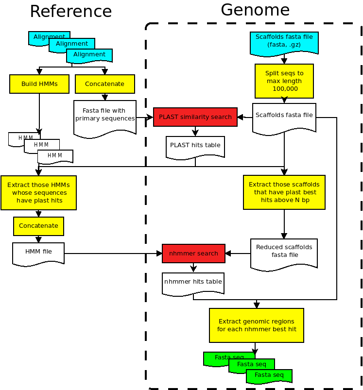
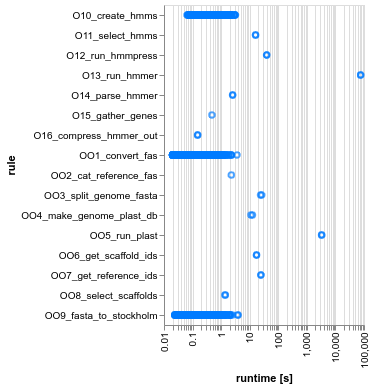
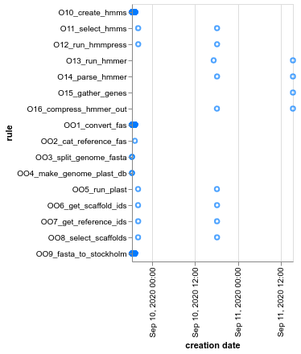

# Birdscanner version 2\_pelle (Snakemake version)

- Last modified: 2026-01-25 18:18:56
- Sign: JN

## Description

The workflow (Fig. \ref{workflow}) will try to extract known genomic regions
(based on multiple- sequence alignments and HMMs; the `Reference`) from a
genome file (the `Genome`). The approach taken is essentially a search with
HMM's against a genome, with an extra step where an initial similarity search
is used to reduce the input data down to matching HMM's and genomic regions.

Both the known genomic regions (multiple nucleotide-sequence alignments in
fasta format), and the genome files (fasta format, one or several scaffolds)
must be provided by the user. If several genomes are provided, the workflow can
also collect each genomic region extracted from each genome (the `Fasta seq`
files), and produce unaligned "gene" files. These can, for example, be the
input for further processing with a multiple-sequence alignment software.

{width=60%}

## Installation and testing

**Note:** For installing and running on the Pelle cluster, skip to
[**relevant section below**.](#installing-and-running-birdscanner2-on-pelle)

### Local installation

1. Install prerequisites (see section [**Software
   prerequisites**](#software-prerequisites) for details). On a Debian-based
   GNU/Linux system (tested on Ubuntu Linux 24.04), this can be done using

        $ sudo apt install build-essential git hmmer ncbi-blast+ pigz plast snakemake
        $ git clone https://github.com/nylander/split-fasta-seq.git
        $ cd split-fasta-seq/src/ && make && sudo make install 

2. Clone birdscanner2 from GitHub:

        $ git clone https://github.com/nylander/birdscanner2.git

3. Optional: Download example data (636 MB) and test the installation

        $ cd birdscanner2
        $ wget -c "https://nrmcloud.nrm.se/s/2Z8MsQCMRfgterQ/download" -O - | tar xvz
        $ snakemake --debug-dag --printshellcmds --cores all --dry-run
        $ snakemake --debug-dag --printshellcmds --cores all

## Input

Place properly named genome files (fasta format, gzip compressed, `.gz`) in
`data/genomes/` and properly named reference files (aligned fasta files,
`.fas`) in `data/references/`. See section [**Data**](#data) for details on the data
format.

Example set up:
```
data/
├── genomes
│   ├── Apa.gz
│   └── Bpa.gz
└── references
    ├── 1.fas
    └── 2.fas
```

## Output

Output are written to the folder `results/`.

Example output:
```
results/
├── genes
│   ├── 1.fas
│   └── 2.fas
├── genomes
│   ├── Apa
│   │   ├── Apa.1.fas
│   │   └── Apa.2.fas
│   └── Bpa
│       ├── Bpa.1.fas
│       └── Bpa.2.fas
└── hmmer
    ├── Apa.hmmer.out.gz
    └── Bpa.hmmer.out.gz
```

## Run

    $ cd birdscanner2
    $ snakemake -p

## Data

Note: The pipeline is very picky about the format of both file names and file
content. Safest option is to make sure they are OK before trying to run the
analyses.

### Indata

##### 1. Genomes

Add compressed (gzip) genome files (contig files in fasta format, nucleotide
data) to the folder `data/genomes/`. Files need to be named `<name>.gz`. The
`<name>` should contain no periods, and will be used in the output as part of
the fasta header for the extracted sequences. Examples: `apa_genome.gz`,
`bpa.gz` (but not, e.g., `apa.genome.fas.gz`, `bpa.tar.gz`, etc).

##### 2. Reference alignments

Add reference sequence alignments (nucleotides, fasta format, file suffix
`.fas`) in the folder `data/references/`. Each alignment file would represent
one genomic region ("gene").

The name of the alignment file will be used in downstream analyses, so they
should have names that are easy to parse (do not use spaces or special
characters, not even hyphens (`-`) in the file names). Examples: `myo.fas`,
`odc.fas`, `988.fas`, `999.fas`, etc.

The fasta headers are also used in downstream analyses and should also be easy
to parse.  Examples, `>Passe`, `>Ploceu`, `>Prunell`. Use underscores (`_`)
instead of hyphens (`-`). Fasta headers needs to be unique (i.e., no duplicates
in each individual alignment), but the number of sequences doesn't need to be
the same in all files.

##### 2.2 Jarvis bird data

We also provide filtered versions of the "Jarvis data"
([Jarvis *et al*.2015](resources/Jarvis_et_al_2015/Jarvis_et_al_2015.pdf)).
If you wish to use any of these data sets, it is recommend to download and uncompress the data
(`references.tgz`) directly inside the `birdscanner2/data/` folder. Please see
the file
[`resources/Jarvis_et_al_2015/README.md`](resources/Jarvis_et_al_2015/README.md)
for full description.

### Outdata

Individual `gene` files (fasta format) for each `genome` are written to the
folder `results/genome/<genome>/`, with the default name `<genome>.<gene>.fas`.
The fasta header contains the genome name: `><genome>` and some statistics from
the HMMer search.

The output files from the hmmer-search step is also saved as compressed text
files, one for each genome, as `results/hmmer/<genome>.hmmer.out.gz`.

The gene files are also concatenated and written to the folder
`results/genes/`, one file for each gene (`results/genes/<gene1>.fas`,
`results/genes/<gene2>.fas`, etc). The fasta headers contains the genome names:
`><genome>`, and these files can be input to a software for doing
multiple-sequence alignments.

## Concatenate output from separate runs

If different runs have been made *with the same references data*, then the
separate runs can be combined using the helper script
[`bs2-gather-genes.pl`](workflow/scripts/bs2-gather-genes.pl). For example, if
genome `Apa.gz` and `Bpa.gz` have been run against the same set of references
at different occasions, the individual files in `results/genomes/Apa/` and
`results/genomes/Bpa/` can be concatenated to fasta files ready for
multiple-sequence alignment:

    $ bs2-gather-genes.pl --outdir=out /path/to/results/genomes/Apa /path/to/results/genomes/Bpa

The concatenated files are in folder `out/`. Note that not all genomes may have
the same number of output files in `results/genomes/`, hence the number of
sequences in the concatenated files may not be the same.

## Software prerequisites

The workflow is tested on GNU/Linux (Ubuntu 22.04), and uses standard Linux
(bash) tools in addition to the main workflow manager `snakemake` (**v.7
(!)**). A list of tools (and tested version) are given below.  See also section
[**Installing and Running birdscanner2 on
Pelle**](#installing-and-running-birdscanner2-on-pelle) (where most of the
required software are already available as modules).

1. [bash](https://www.gnu.org/software/bash/) (5.0.18)
    - awk (5.0.1)
    - cat (8.30)
    - find (4.7.0)
    - grep (3.4)
    - sort (8.30)
2. [python](https://www.python.org/downloads/) (3.10.12)
3. [snakemake](https://snakemake.github.io/) (7.25.0)
4. [pigz](https://zlib.net/pigz/) (2.8)
5. [makeblastdb](https://ftp.ncbi.nlm.nih.gov/blast/executables/blast+/LATEST/) (2.16.0+)
6. [blastdbcmd](https://ftp.ncbi.nlm.nih.gov/blast/executables/blast+/LATEST/) (2.16.0+)
7. [hmmbuild](http://hmmer.org/download.html) (3.4)
8. [hmmpress](http://hmmer.org/download.html) (3.4)
9. [nhmmer](http://hmmer.org/download.html) (3.4)
10. [perl](https://www.perl.org/get.html) (5.34.0)
11. [plast](https://github.com/PLAST-software/plast-library) (2.3.2)
12. [splitfast](https://github.com/nylander/split-fasta-seq) (Tue 14 Jan 2020)
13. [bs2-fas-to-sto.pl](workflow/scripts/bs2-fas-to-sto.pl) (1.0)
14. [bs2-parse-nhmmer.pl](workflow/scripts/bs2-parse-nhmmer.pl) (1.0)
15. [bs2-gather-genes.pl](workflow/scripts/bs2-gather-genes.pl) (1.0)

Softwares 13-15 are provided. Software requirements 1-10 can also be
taken care of by the [conda system](https://docs.conda.io/) by running the
pipeline with commands

    $ snakemake --use-conda

Note: This requires conda, and is currently mostly untested.
Furthermore, softwares 11, and 12 still needs to be installed separately
(currently not in any conda channels).

## Installing and Running birdscanner2 on Pelle

**Note: Updated 2026-01-25**

### 1. Install software

On [Pelle](https://www.uu.se/centrum/uppmax/resurser/kluster/pelle), most
software are available as modules. However, `snakemake`, `plast` and `splitfast`
programs need to be installed manually. For example (tested on cluster
["Pelle"](https://docs.uppmax.uu.se/cluster_guides/pelle/), and
assuming that the folder `$HOME/bin` is present and in your `PATH`):

#### 1.1. plast

Note: I recommend compiling (there might be memory errors otherwise):

    $ module load CMake/3.31.3-GCCcore-14.2.0 Doxygen/1.14.0-GCCcore-14.3.0
    $ git clone https://github.com/PLAST-software/plast-library.git
    $ cd plast-library
    $ git checkout stable
    $ sed -i '98,99{s/^/#/}' CMakeLists.txt # if no cppunit, disable unittest
    $ mkdir build
    $ cd build
    $ cmake -Wno-dev ..
    $ make
    $ cp bin/PlastCmd $HOME/bin/plast

#### 1.2. splitfast

    $ git clone https://github.com/nylander/split-fasta-seq.git
    $ cd split-fasta-seq/src
    $ make
    $ cp splitfast $HOME/bin/

#### 1.3. snakemake

Provided you have mamba (conda) available (see e.g., <https://hackmd.io/@pmitev/conda_on_Rackham>).

    $ mamba create -y -c conda-forge -c bioconda -c nodefaults -n snakemake7.25 snakemake=7.25.0

### 2. Clone birdscanner2

    $ git clone https://github.com/nylander/birdscanner2.git
    $ cd birdscanner2
    $ git checkout bs2_pelle

### 3. Add your uppmax account number

Manually edit the file [`pelle/settings.json`](pelle/settings.json), and add
your [SNIC compute project account
number](https://supr.naiss.se/public/project/)
(e.g., "snic2020-12-34"). For example:

    $ sed -i 's/SNICACCOUNT/snic2020-12-34/' pelle/settings.json

### 4. Add genome and reference data

See [**Section Indata**](#indata)

### 5. Run the initial data conversion

Note, this step is an ad-hoc step currently used to avoid submission of too
many snakemake rules to slurm. The expected output is a folder,
`birdscanner2/run/tmp`, with fasta and Stockholm files. Please make sure to
replace the "snic1234-56-78" below with your SNIC account number.

    $ sbatch -A snic1234-56-78 -t 60 workflow/scripts/bs2-convert.slurm.sh

### 6. Run the rest of the workflow

Allow the previous slurm job to finish, and then procede below.

- **6.1. Launch a screen session**

        $ screen -S birdscanner2

- **6.2. Load modules**

       $ module load \
             HMMER/3.4-GCC-13.3.0 \
             BLAST+/2.16.0-GCC-13.3.0\
             pigz/2.8-GCCcore-13.3.0

- **6.3. Load and start snakemake**

        $ mamba activate snakemake7.25
        (snakemake7.25)$ snakemake --profile rackham

- **6.4. Detach the screen session** (Ctrl-A + Ctrl-D)

Re-attaching to the screen session is done with `screen -R birdscanner2`.
When the workflow is finished, remember to exit the screen session!

Jobs on the cluster can be monitored with command `jobinfo`. Or, perhaps better:

    $ squeue --user=$USER -M rackham --format="%.8i %.50j %.8u %.8T %.10M %.10l %.9P %.6C %.6D %.16R"

## Run time

A runtime example (output from `snakemake --report` after succesful run) is
given below. The input was two genomes (nseqs=2393, avg.len=463145, and
nseqs=2401, avg.len=461424, respectively), and reference data consisted of
7,979 multiple sequence alignments (avg.len=1491). The analysis was run on one
multi-core computer.

{width=40%}

The bottle-necks in the workflow are the similarity searches using `plast`, and
most noticeable, the search with `nhmmer`. These will take a long time. In
Figure \ref{runtime} we can see that the plast-search (`005_run_plast`) took
about 55 min per genome, and that the nhmmer-search (`O13_run_hmmer`) took around
20h per genome.  Hence, the whole process of analysing the two genomes took
almost two days.

{width=40%}

Note: if one scrutinizes the creation dates of the output files for individual
genomes, we see that processing of genomes are essentially serial (Fig.
\ref{creationdate}). Work on parallelize this process on a single machine is
currently in progress.

## License and Copyright

Copyright (c) 2020-2026 Johan Nylander

Permission is hereby granted, free of charge, to any person obtaining a copy
of this software and associated documentation files (the "Software"), to deal
in the Software without restriction, including without limitation the rights
to use, copy, modify, merge, publish, distribute, sublicense, and/or sell
copies of the Software, and to permit persons to whom the Software is
furnished to do so, subject to the following conditions:

The above copyright notice and this permission notice shall be included in all
copies or substantial portions of the Software.

THE SOFTWARE IS PROVIDED "AS IS", WITHOUT WARRANTY OF ANY KIND, EXPRESS OR
IMPLIED, INCLUDING BUT NOT LIMITED TO THE WARRANTIES OF MERCHANTABILITY,
FITNESS FOR A PARTICULAR PURPOSE AND NONINFRINGEMENT. IN NO EVENT SHALL THE
AUTHORS OR COPYRIGHT HOLDERS BE LIABLE FOR ANY CLAIM, DAMAGES OR OTHER
LIABILITY, WHETHER IN AN ACTION OF CONTRACT, TORT OR OTHERWISE, ARISING FROM,
OUT OF OR IN CONNECTION WITH THE SOFTWARE OR THE USE OR OTHER DEALINGS IN THE
SOFTWARE.

